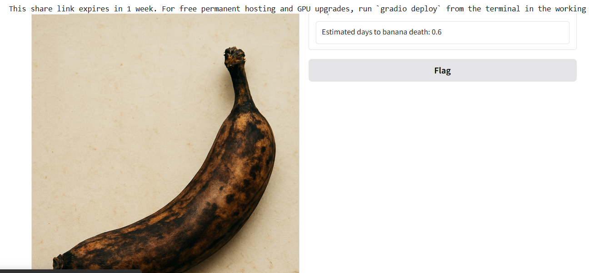

# 🍌 Banana Ripeness Predictor

[](https://www.python.org/) 
[](https://pytorch.org/) 
[](https://streamlit.io/) 
[](LICENSE)
[](https://share.streamlit.io/USERNAME/banana-ripeness-predictor/main/app.py)

A computer vision regression model that predicts **days until a banana becomes rotten** based on its ripeness stage.

---

## 🌟 Features
- Upload your own banana image  
- Test with sample dataset images  
- Pretrained ResNet18 finetuned on banana ripeness dataset  
- Interactive Streamlit app for real-time predictions  
- Easy to retrain on your own banana dataset

---

## 🎬 Demo


*Example workflow of the app showing banana ripeness prediction*  

---

## 🛠️ Installation

### 1️⃣ Clone the repository
```bash
git clone https://github.com/USERNAME/banana-ripeness-predictor.git
cd banana-ripeness-predictor


